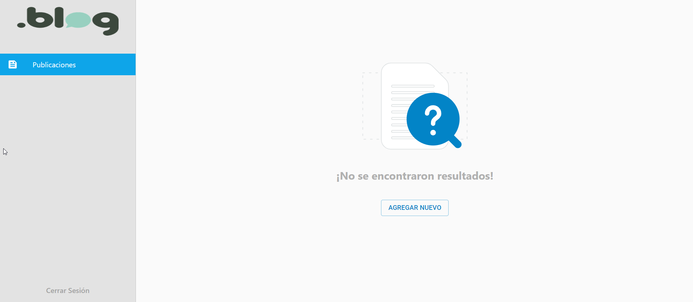
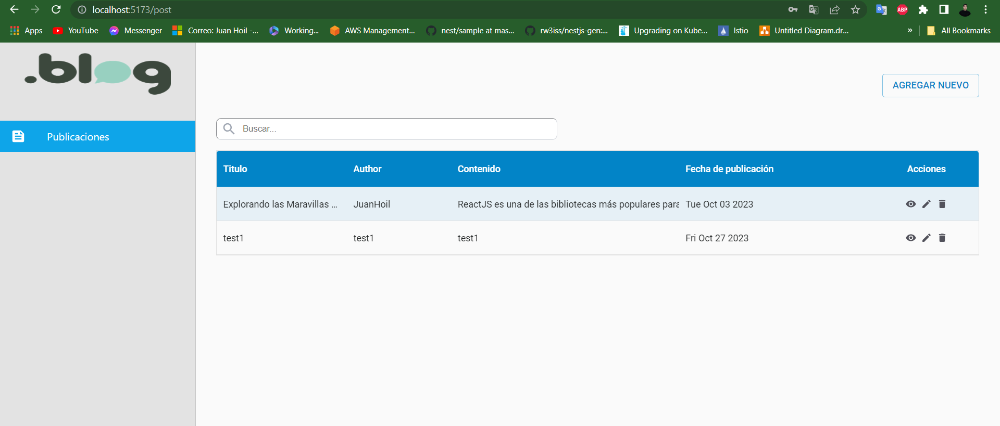
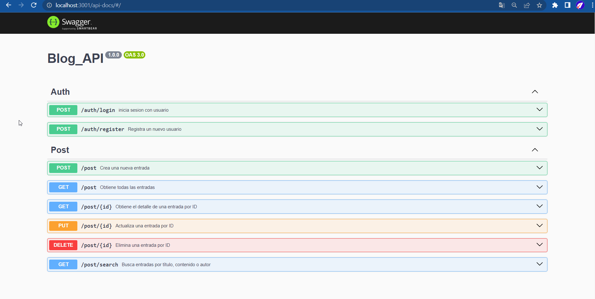

# Reto Grupo Promass

 <!-- alt = img -thumbnail -->


Este proyecto consta de dos partes: el backend y el frontend, que se encargan de proporcionar una solución de software. A continuación, se detallan los pasos para utilizar cada uno de ellos.


- [backend](#backend)
- [frontend](#frontend)
- [Cómo implementar](#cómo-implementar)
  - [Docker](#docker)


## Backend

### Cómo usar


1. Crea el archivo `.env` siguiendo el ejemplo de `.env.example`.
2. Conecta tu base de datos en PostgreSQL.
3. Asegúrate de tener Node.js instalado (versión >= 18.15.0).
4. Ejecuta los siguientes comandos:
```bash

# install dependencies
npm install
# Start the bot service
npm run dev

O

# install dependencies
yarn install
# Start the bot service
yarn dev
```
5. abre http://localhost:3001/api-docs/#/ en tu navegador.
6. Registra un usuario utilizando Swagger: http://localhost:3001/api-docs/#/Auth/post_auth_register
```bash
{
  "email": "usuario@example.com",
  "password": "password123"
}
```


### frontend
### Cómo usar

1. Conéctate al backend que se ejecuta de forma predeterminada en el puerto 3001.
2. Asegúrate de tener Node.js instalado (versión >= 18.15.0).
3. Ejecuta los siguientes comandos:
```bash

# install dependencies
npm install
# Start the bot service
npm run dev

O

# install dependencies
yarn install
# Start the bot service
yarn dev
```
4. Inicia sesión con el usuario que registraste previamente:

## Cómo implementar

### Docker

```bash
# Pull image
docker pull postgres

# Run
docker run --name postgres -e POSTGRES_PASSWORD=tu_contraseña -p 5432:5432 -d postgres

# add user
docker exec -it postgres psql -U postgres
```

## License

MIT © juanhoil